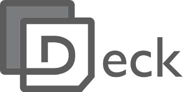

# Deck

Deck is a markdown driven content presentation system

This is a master repo for all deck repos

Please log any issues here

* [deck-app](https://github.com/nearform/deck-app)  (entry point)
* [deck-app-unscoped](https://github.com/nearform/deck-app-unscoped)
* [deck-base](https://github.com/nearform/deck-base)
* [deck-base-theme](https://github.com/nearform/deck-base-theme)
* [deck-example-deck](https://github.com/nearform/deck-example-deck)
* [deck-gui](https://github.com/nearform/deck-gui)
* [deck-present](https://github.com/nearform/deck-present)
* [deck-presenter](https://github.com/nearform/deck-presenter)
* [deck-skin-light](https://github.com/nearform/deck-skin-light)
* [deck-terminal-logo](https://github.com/nearform/deck-terminal-logo)
* [deck-upstream](https://github.com/nearform/deck-upstream)

## Technologies

The deck system is built on and/or utilizes:

* [Electron](http://electron.atom.io)
* [Gulp](http://gulpjs.com/)
* [Bespoke.js](http://markdalgleish.com/projects/bespoke.js/)
* [Markdown](https://daringfireball.net/projects/markdown/)
* [YAML](http://yaml.org)
* [NPM](http://npmjs.org)
* [GitHub](http://github.com)

## Credits

Sponsored by <a href="http://nearform.com">nearForm</a>

## Contributors

* David Mark Clements
* Mihai Dima
* Cristian Kiss

## Contributing

Deck is an **OPEN Open Source Project**. This means that:

> Individuals making significant and valuable contributions are given commit-access to a project to contribute as they see fit. A project is more like an open wiki than a standard guarded open source project.

See the [`CONTRIBUTING.md`](CONTRIBUTING.md) file for more details.